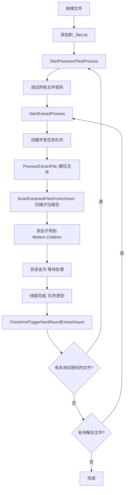

# AutoUnpackTool 执行流程详细分析文档（V2 - 统一树状流程）

## 📋 目录
1. [整体架构](#整体架构)
2. [核心数据结构](#核心数据结构)
3. [主执行流程](#主执行流程)
4. [递归解压流程](#递归解压流程)
5. [问题分析](#问题分析)
6. [关键代码路径](#关键代码路径)

---

## 整体架构

### 核心组件
```
MainWindow (UI层)
├── _fileList: ObservableCollection<FileItem>          // 文件列表（树形结构）
├── _passwordMap: PasswordMap                          // 密码映射表（线程安全）
├── _settings: AppSettings                             // 配置信息
├── _isExtracting: bool                                // 是否正在解压
└── _isTesting: bool                                   // 是否正在测试密码

FileItem (文件项)
├── FileName: string                                   // 文件名
├── FilePath: string                                   // 文件路径
├── Status: string                                     // 状态
├── FoundPassword: string?                             // 找到的密码
├── Children: ObservableCollection<FileItem>           // 子压缩包列表
├── Parent: FileItem?                                  // 父级文件项
└── VolumeInfo: ArchiveVolumeInfo?                     // 分卷信息
```

### 状态流转（统一树状流程）
```
等待处理 → 正在测试密码 → 密码正确/无密码 → 正在解压 → 解压成功
                                    ↓
                            扫描子压缩包 → 添加子项（状态=等待处理）
                                    ↓
                            下一轮检查 → 测试子项密码 → 解压子项
                                    ↓
                            （递归继续...）

所有文件都是 FileItem，形成树状结构：
- 直接拖进来的文件：Parent = null
- 从压缩包解压出来的：Parent = 父压缩包
- 子压缩包完全复用父压缩包的流程
```

### 流程图


---

## 核心数据结构

### 1. FileItem 树形结构
```csharp
// 示例：嵌套压缩包的树形结构
_root
├── 1动n.7z.001 (顶级文件)
│   ├── Status: "解压成功 (无密码)"
│   └── Children
│       └── 1动n.7z删 (子压缩包)
│           ├── Status: "等待处理"  ⚠️ 问题点
│           └── Children: []
```

### 2. PasswordMap 密码映射表
```csharp
// 存储文件路径到密码的映射
{
    "D:\\tem\\test\\1动n.7z.001": null,        // 无密码
    "D:\\tem\\test\\1动n\\1动n.7z删": null      // 子压缩包密码（测试后添加）
}

// 关键操作：
// - 解压成功后会 Remove(filePath)  // ⚠️ 这可能导致问题
// - 密码测试后会 Add(filePath, password)
```

---

## 主执行流程

### 流程1：拖拽文件 → 自动处理
```
Window_Drop (第92行)
  ↓
检测到压缩文件
  ↓
添加到 _fileList
  ↓
Dispatcher.InvokeAsync(async () => {
    await StartPasswordTestProcess()        // 阶段1：密码测试
      ↓
    if (自动模式 && 找到密码) {
        await StartExtractProcess()         // 阶段2：解压
    }
})
```

**代码位置：** `MainWindow.xaml.cs` 第160-179行

---

### 流程2：密码测试流程 (StartPasswordTestProcess)

```
StartPasswordTestProcess(testOnlyNewFiles: false)  [第610行]
  ↓
1. 设置 _isTesting = true
  ↓
2. 确定要测试的文件列表
   - 如果 testOnlyNewFiles=true: 只测试 !_passwordMap.ContainsKey 的文件
   - 否则：测试 CollectAllFileItems(_fileList) 所有文件
  ↓
3. 遍历每个文件：
   a. 先测试无密码
   b. 如果失败，遍历密码本测试
   c. 找到密码后：_passwordMap.Add(filePath, password)
  ↓
4. 保存密码使用记录
  ↓
5. 如果是自动模式且找到密码：
   await StartExtractProcess()
  ↓
6. 设置 _isTesting = false
```

**关键点：**
- 支持增量测试（只测试新文件）
- 测试结果存入 `_passwordMap`
- 自动模式下会自动触发解压

**代码位置：** `MainWindow.xaml.cs` 第610-771行

---

### 流程3：解压流程 (StartExtractProcess)

```
StartExtractProcess(extractOnlyNewFiles: false)  [第803行]
  ↓
1. 确定要解压的文件列表
   - 如果 extractOnlyNewFiles=true: 
     筛选条件：!Status.Contains("解压成功") && _passwordMap.ContainsKey
   - 否则：_passwordMap.ContainsKey 的所有文件
  ↓
2. 如果没有可解压文件，返回
  ↓
3. 设置 _isExtracting = true
  ↓
4. 创建 ConcurrentQueue<FileItem>(filesToExtract)
  ↓
5. 启动 N 个并发任务（N = ThreadCount）：
   Task.Run(async () => {
       while (!queue.IsEmpty) {
           if (queue.TryDequeue(out fileItem)) {
               if (fileItem.TryLock()) {  // 防止重复处理
                   await ProcessExtractFile(...)
                   fileItem.ReleaseLock()
               }
           }
       }
   })
  ↓
6. await Task.WhenAll(tasks)  // 等待所有线程完成
  ↓
7. ⭐ 关键：调用 CheckAndTriggerNextRoundExtractAsync()
  ↓
8. finally: _isExtracting = false
```

**关键点：**
- 使用 `ConcurrentQueue` 实现多线程并发
- 使用 `TryLock()` 防止多个线程处理同一文件
- **在第901行调用 `CheckAndTriggerNextRoundExtractAsync()`**

**代码位置：** `MainWindow.xaml.cs` 第803-918行

---

### 流程4：处理单个文件解压 (ProcessExtractFile)

```
ProcessExtractFile(fileItem, extractor, taskId, token)  [第923行]
  ↓
1. 从 _passwordMap 获取密码
   - 如果没有密码：标记为"跳过"，返回
  ↓
2. 执行解压：await extractor.ExtractAsync(...)
  ↓
3. 如果解压成功：
   a. 更新状态为"解压成功"
   b. 处理原文件（删除/移动/保留）
   c. ⭐ 关键：_passwordMap.Remove(filePath)  // 移除已处理的文件
   d. ⭐ 关键：await ScanExtractedFilesForArchives(...)  // 扫描子压缩包
   e. 如果有子项：记录日志，等待子项处理
   f. 如果没有子项：CheckAndMarkParentComplete(fileItem)
  ↓
4. 如果解压失败：
   - 更新状态为"解压失败"
   - 检查父项状态
```

**关键点：**
- **第979行：`_passwordMap.Remove(filePath)`** - 这是关键！
- **第984行：`await ScanExtractedFilesForArchives(...)`** - 同步等待扫描完成

**代码位置：** `MainWindow.xaml.cs` 第923-1048行

---

## 递归解压流程

### 流程5：扫描子压缩包 (ScanExtractedFilesForArchives)

```
ScanExtractedFilesForArchives(outputDir, taskId, parentFileItem)  [第1056行]
  ↓
1. 扫描输出目录中的所有压缩文件
   var allArchiveFiles = Directory.GetFiles(outputDir)
       .Where(f => IsArchiveFile(f) && !IsMultiVolumeArchive(f))
  ↓
2. 如果没有找到压缩文件：
   - 如果 parentFileItem != null: UpdateParentStatusWhenChildrenComplete(parent)
   - 返回
  ↓
3. 遍历每个压缩文件：
   a. 检查是否已存在于树中：FindFileItemInTree(archiveFile)
   b. 如果已存在且需要重试：重置状态为"等待处理"
   c. 如果是新文件：
      - 创建 FileItem (Status = "等待处理", Parent = parentFileItem)
      - 添加到 parentFileItem.Children 或 _fileList
  ↓
4. 如果添加了新文件或需要重试：
   a. await Task.Delay(500)  // 等待UI更新
   b. await Dispatcher.Invoke(async () => {
        await StartPasswordTestProcess(testOnlyNewFiles: true)  // 测试新文件密码
        
        // ⚠️ 修改后的逻辑：不再立即启动解压
        var pendingFiles = CollectAllFileItems(_fileList)
            .Where(f => !f.Status.Contains("解压成功") && 
                        _passwordMap.ContainsKey(f.FilePath))
        
        if (pendingFiles.Count > 0) {
            AppendLog("发现 X 个待解压文件，将在当前解压流程结束后自动处理")
        }
      })
```

**关键点：**
- **第1180行：测试新文件密码** - 会将密码添加到 `_passwordMap`
- **第1186-1202行：检查待解压文件但不启动解压** - 避免与外层冲突
- 依赖外层的 `CheckAndTriggerNextRoundExtractAsync()` 来触发下一轮解压

**代码位置：** `MainWindow.xaml.cs` 第1056-1220行

---

### 流程6：检查并触发下一轮解压 (CheckAndTriggerNextRoundExtractAsync)

```
CheckAndTriggerNextRoundExtractAsync()  [第582行]
  ↓
1. await Task.Delay(300)  // 等待状态更新
  ↓
2. 收集所有待解压文件：
   var pendingFiles = CollectAllFileItems(_fileList)
       .Where(f => !f.Status.Contains("解压成功") && 
                   !f.Status.Contains("跳过") && 
                   !f.Status.Contains("异常") &&
                   _passwordMap.TryGetValue(f.FilePath, out var pwd))
  ↓
3. 如果 pendingFiles.Count > 0 && !_isExtracting:
   await StartExtractProcess(extractOnlyNewFiles: true)
  ↓
4. 否则：记录调试日志
```

**调用时机：**
- 在 `StartExtractProcess` 的第901行，所有线程完成后调用

**关键点：**
- **必须满足两个条件：**
  1. 有待解压文件（在 `_passwordMap` 中有记录）
  2. `_isExtracting == false`（当前没有正在进行的解压）

**代码位置：** `MainWindow.xaml.cs` 第582-604行

---

## 问题分析

### 🔴 核心问题：子压缩包为什么停留在"等待处理"状态？

根据日志分析：
```
[23:03:41]--> [线程 1] [DEBUG] 找到 2 个待解压文件
[23:03:41]--> [线程 1] [DEBUG] 没有待解压文件或正在解压中
```

这说明 `pendingFiles.Count = 2`，但条件判断失败了。

### 可能的原因：

#### 原因1：`_passwordMap` 中缺少子压缩包的密码记录

**检查点：**
```csharp
// 在 ScanExtractedFilesForArchives 第1180行
await StartPasswordTestProcess(testOnlyNewFiles: true);

// 密码测试应该将子压缩包的密码添加到 _passwordMap
// 但如果测试失败或没有找到密码，_passwordMap 中就不会有记录
```

**验证方法：**
查看日志中是否有类似这样的输出：
```
[测试] 1动n.7z删
  测试: 无密码...
  ✓ 无密码测试成功
[1动n.7z删] 测试结果: 无密码
```

如果有，说明密码测试成功了，`_passwordMap` 中应该有记录。

---

#### 原因2：`_isExtracting` 仍然为 true

**检查点：**
```csharp
// 在 CheckAndTriggerNextRoundExtractAsync 第595行
if (pendingFiles.Count > 0 && !_isExtracting)
```

**时序分析：**
```
时间线：
T1: 线程1 解压 1动n.7z.001 完成
T2: 线程1 调用 ScanExtractedFilesForArchives
T3: ScanExtractedFilesForArchives 添加子压缩包并测试密码
T4: ScanExtractedFilesForArchives 返回
T5: 线程1 完成，Task.WhenAll 返回
T6: StartExtractProcess 调用 CheckAndTriggerNextRoundExtractAsync
T7: CheckAndTriggerNextRoundExtractAsync 检查 _isExtracting

问题：在 T6 时，_isExtracting 仍然是 true（因为还没执行到 finally）
```

**但是！** 查看代码第901行和第913行：
```csharp
// 第901行：在 try 块内调用
await CheckAndTriggerNextRoundExtractAsync();

// 第913行：在 finally 块内设置
finally {
    _isExtracting = false;
}
```

所以调用 `CheckAndTriggerNextRoundExtractAsync()` 时，`_isExtracting` 确实是 `true`！

**这就是问题所在！** ⚠️

---

#### 原因3：子压缩包的状态不符合条件

**检查点：**
```csharp
// 第588-592行
var pendingFiles = CollectAllFileItems(_fileList).Where(f => 
    !f.Status.Contains("解压成功") && 
    !f.Status.Contains("跳过") && 
    !f.Status.Contains("异常") &&
    _passwordMap.TryGetValue(f.FilePath, out var pwd)
).ToList();
```

如果子压缩包的状态是：
- "等待处理" ✅ 符合条件
- "正在测试密码" ❌ 不符合（但这个状态应该已经结束了）
- "解压成功" ❌ 不符合

---

### 🔍 根本原因定位

结合日志和代码分析，**最可能的原因是：**

**在 `CheckAndTriggerNextRoundExtractAsync()` 被调用时，`_isExtracting` 仍然是 `true`，导致条件判断失败。**

虽然我们在第901行调用了 `CheckAndTriggerNextRoundExtractAsync()`，但此时还在 `try` 块内，`_isExtracting` 还没有被设置为 `false`（那是在第913行的 `finally` 块中）。

---

## 关键代码路径总结

### 完整执行路径（以你的案例为例）

```
1. 用户拖拽 1动n.7z.001
   ↓
2. Window_Drop → StartPasswordTestProcess()
   - 测试密码：无密码
   - _passwordMap.Add("1动n.7z.001", null)
   ↓
3. StartExtractProcess()
   - _isExtracting = true
   - 创建队列：[1动n.7z.001]
   - 启动2个线程
   ↓
4. [线程1] ProcessExtractFile(1动n.7z.001)
   - 解压成功
   - _passwordMap.Remove("1动n.7z.001")  ⚠️ 移除
   - ScanExtractedFilesForArchives("D:\\tem\\test\\1动n")
     ↓
     a. 发现 1动n.7z删
     b. 创建 FileItem，添加到 parent.Children
     c. StartPasswordTestProcess(testOnlyNewFiles: true)
        - 测试 1动n.7z删：无密码
        - _passwordMap.Add("1动n.7z删", null)  ⚠️ 添加
     d. 检查待解压文件：找到1个（1动n.7z删）
     e. 记录日志，不启动解压
   ↓
5. [线程1] 完成
6. [线程2] 完成（队列为空）
7. Task.WhenAll 返回
8. CheckAndTriggerNextRoundExtractAsync()
   - 检查条件：
     * pendingFiles.Count = 1 (1动n.7z删)
     * _isExtracting = true  ⚠️ 问题！
   - 条件失败，不启动解压
9. finally: _isExtracting = false
10. 结束

结果：1动n.7z删 停留在"等待处理"状态 ❌
```

---

## 解决方案

### 方案1：调整调用时机（推荐）⭐

将 `CheckAndTriggerNextRoundExtractAsync()` 的调用移到 `finally` 块之后：

```csharp
finally
{
    _isExtracting = false;
    _extractCancellationTokenSource?.Dispose();
    _extractCancellationTokenSource = null;
    UpdateUiState();
}

// 在 finally 之后调用，确保 _isExtracting 已经是 false
await CheckAndTriggerNextRoundExtractAsync();
```

**优点：**
- 简单直接
- 确保 `_isExtracting` 为 false

**缺点：**
- 如果在 `finally` 中发生异常，可能不会执行

---

### 方案2：修改判断条件

在 `CheckAndTriggerNextRoundExtractAsync()` 中，允许在即将结束解压时触发新一轮：

```csharp
// 不检查 _isExtracting，而是检查是否有其他解压正在进行
if (pendingFiles.Count > 0)
{
    // 延迟一下，等待当前解压流程完全结束
    await Task.Delay(500);
    
    if (!_isExtracting)
    {
        await StartExtractProcess(extractOnlyNewFiles: true);
    }
}
```

**优点：**
- 更灵活
- 可以处理更多边界情况

**缺点：**
- 增加了延迟
- 可能有竞态条件

---

### 方案3：使用标志位

添加一个新的标志位来表示"正在等待下一轮解压"：

```csharp
private bool _isWaitingForNextRound = false;

// 在 CheckAndTriggerNextRoundExtractAsync 中
if (pendingFiles.Count > 0 && !_isExtracting && !_isWaitingForNextRound)
{
    _isWaitingForNextRound = true;
    try
    {
        await StartExtractProcess(extractOnlyNewFiles: true);
    }
    finally
    {
        _isWaitingForNextRound = false;
    }
}
```

**优点：**
- 明确的状态管理
- 防止重复触发

**缺点：**
- 增加了复杂度

---

## 建议

**推荐使用方案1**，因为它最简单且最直接地解决了问题。

修改位置：`MainWindow.xaml.cs` 第896-917行

```csharp
// 等待所有线程完成
await Task.WhenAll(tasks);

AppendLog($"\n========== 解压完成 ==========", ConsoleColor.Green);
}
catch (OperationCanceledException)
{
    AppendLog("\n解压已取消", ConsoleColor.Yellow);
}
catch (Exception ex)
{
    AppendLog($"\n解压出错: {ex.Message}", ConsoleColor.Red);
}
finally
{
    _isExtracting = false;
    _extractCancellationTokenSource?.Dispose();
    _extractCancellationTokenSource = null;
    UpdateUiState();
}

// ⭐ 在 finally 之后调用，确保 _isExtracting 已经是 false
await CheckAndTriggerNextRoundExtractAsync();
```

---

## 调试建议

为了更好地追踪问题，建议在关键位置添加更多日志：

1. **在 `CheckAndTriggerNextRoundExtractAsync` 开始时：**
```csharp
AppendLog($"[DEBUG] CheckAndTriggerNextRoundExtractAsync 开始", ConsoleColor.Magenta);
AppendLog($"[DEBUG] _isExtracting = {_isExtracting}", ConsoleColor.Magenta);
AppendLog($"[DEBUG] _passwordMap.Count = {_passwordMap.Count}", ConsoleColor.Magenta);
```

2. **在收集待解压文件后：**
```csharp
foreach (var f in pendingFiles)
{
    AppendLog($"[DEBUG] 待解压文件: {f.FileName}, Status={f.Status}, HasPassword={_passwordMap.ContainsKey(f.FilePath)}", ConsoleColor.Magenta);
}
```

3. **在条件判断后：**
```csharp
AppendLog($"[DEBUG] 条件检查结果: pendingFiles.Count={pendingFiles.Count}, !_isExtracting={!_isExtracting}", ConsoleColor.Magenta);
```

这样可以帮助你更准确地定位问题所在。
